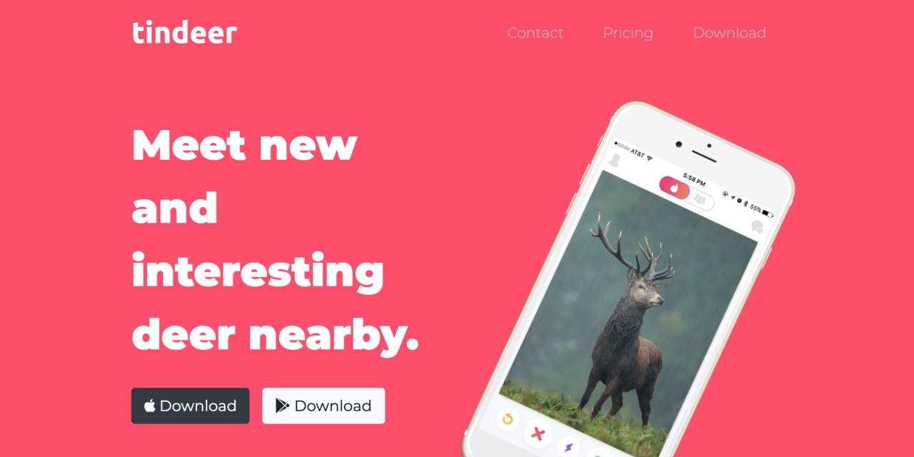

# tindeer  

This is a landing page for a non-existent tinder knock-off app, for... deer.  
It was created solely as an exercise while practicing the usage of Bootstrap 4 (v4.3.1) in an HTML and CSS webpage.  

No deer were harmed during its creation.  

  

The actual landing page link is: [https://dimitristsaknakis.github.io/tindeer/](https://dimitristsaknakis.github.io/tindeer/)  

   

---  

**Big shoutout to [Dr. Angela Yu](https://github.com/angelabauer) for both [her courses](https://www.udemy.com/user/4b4368a3-b5c8-4529-aa65-2056ec31f37e/) and for the inspiration**.  

